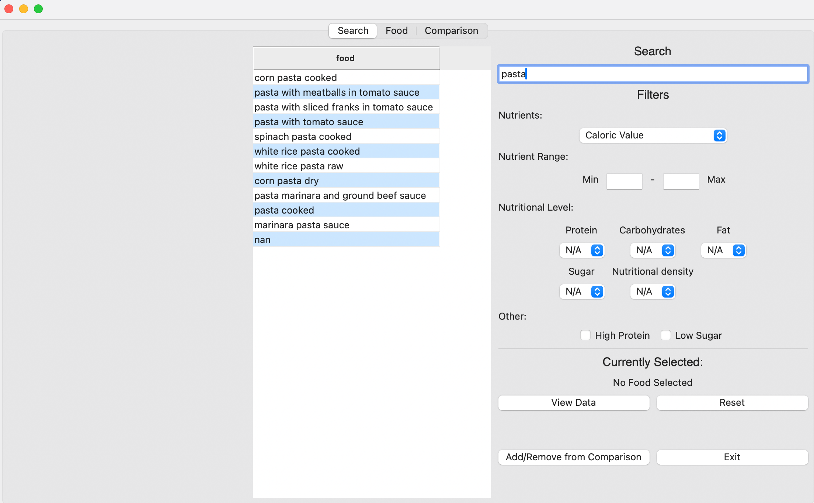
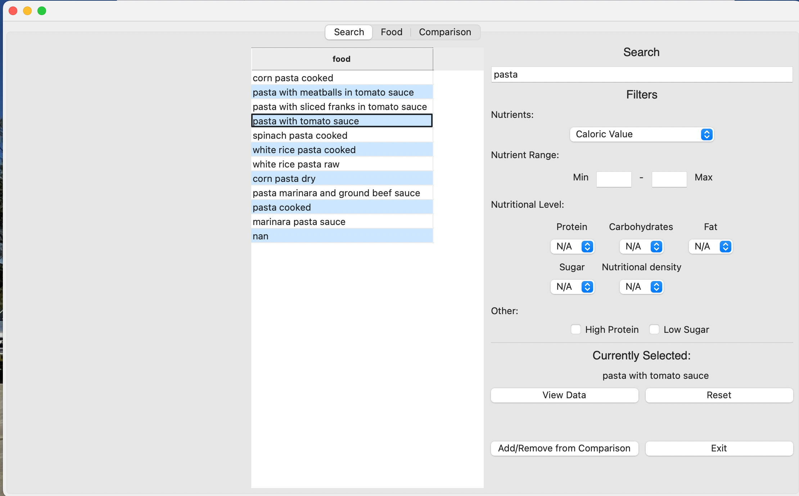
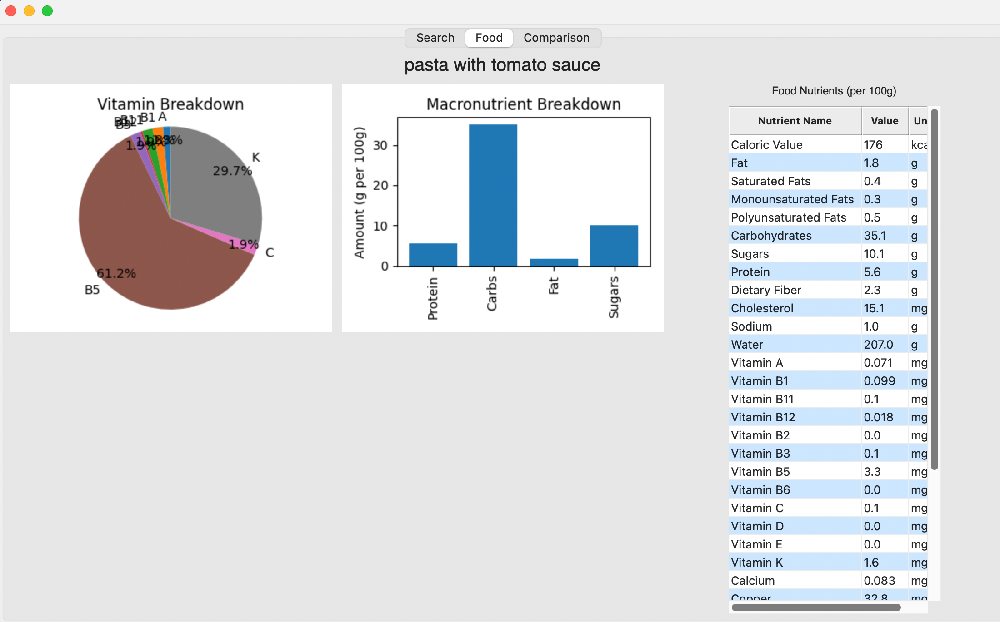

# Executive Summary for Group Number: 049

Our GitHub repository link.
### GitHub Repository URL: https://github.com/NickBland/2810ICT-milestone-2.git

---

You should use your software to prepare an executive summary as outlined below for the five required features.

## 1. Food Search
### Description  
The Food Search feature allows users to quickly find comprehensive nutritional information about specific food items. Users enter the food name, and the system retrieves all relevant nutritional data, which is categorized by aspects such as calories, fats, vitamins, minerals, etc.

### Steps
1. Begin typing the name of the food item in the search bar.
2. When the desired item appears in the list, double-click on it to select.
3. Click the "Food" tab to view the nutritional information on the right hand side. 

### Screenshots
Screenshots for each step demonstrating the use of this feature.  
[Step 1]
[Step 2]
[Step 3]

---

## 2. Nutrition Breakdown
### Description  
The Nutrition Breakdown allows users to select a food item and generate visualizations such as pie charts and bar graphs which will show the breakdown of different nutrients.

### Steps
1. Begin typing the name of the food item in the search bar. 
2. When the desired item appears in the list, double-click on it to select.
3. Click the "Food" tab to view the pie charts and bar graphs of the selected foods on the left and middle of the page.

### Screenshots
Include screenshots for each step demonstrating the use of this feature.  
[Step 1]
[Step 2]
[Step 3]

---

## 3. Nutrition Range Filter
### Description  
The system shall allow users to select a nutritional category (eg protein or fat) and specify a range (minimum and maximum values). The tool then displays foods that fall within the selected range.

### Steps
1. Select the type of nutrients. 
2. Type the Min and Max range of the nutrients.
3. The foods that fit within the nutrients range will appear on the left-hand side of the page.

### Screenshots
Include screenshots for each step demonstrating the use of this feature.    

---

## 4. Nutrition Level Filter
### Description  
The system allows users to filter foods based on predefined nutritional levels (low, mid, high) for specific nutrients, including fat, protein, carbohydrates, sugar, and nutritional density.

### Steps
1. Just click on the nutrition desired to filter by and select (Low, Mid or High).
2. For either high Protein or Low sugar just tick the desired box.
3. All results will appear on the left-hand side of the screen.

### Screenshots
Include screenshots for each step demonstrating the use of this feature.    

---

## 5. food comparison
### Description  
The system allows users to select multiple foods and generate side by side comparisons of their nutritional content.

### Steps
1. Double-click the first food you want to compare then click Add to comparison.  
2. Then do the same for the second food you want to compare.
3. Next press the comparison tab to see the nutritional comparison.
4. You can also click the Micronutrients and the Macronutrients to see graphs of the Micronutrients and the Macronutrients.
### Screenshots
Include screenshots for each step demonstrating the use of this feature.    

---
