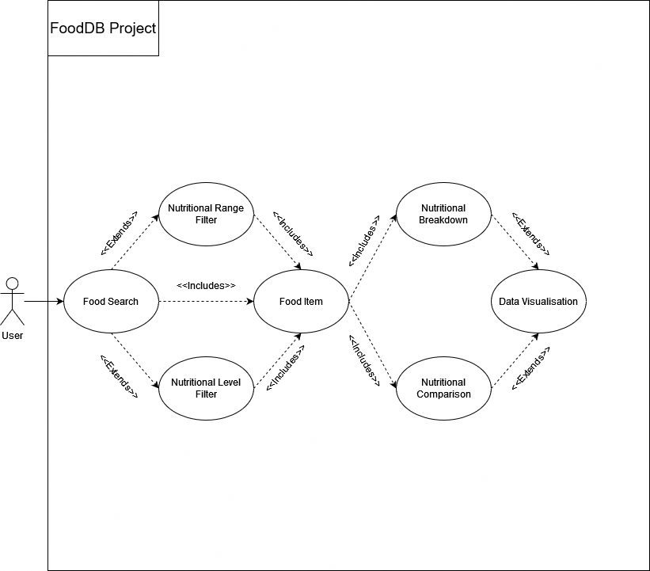
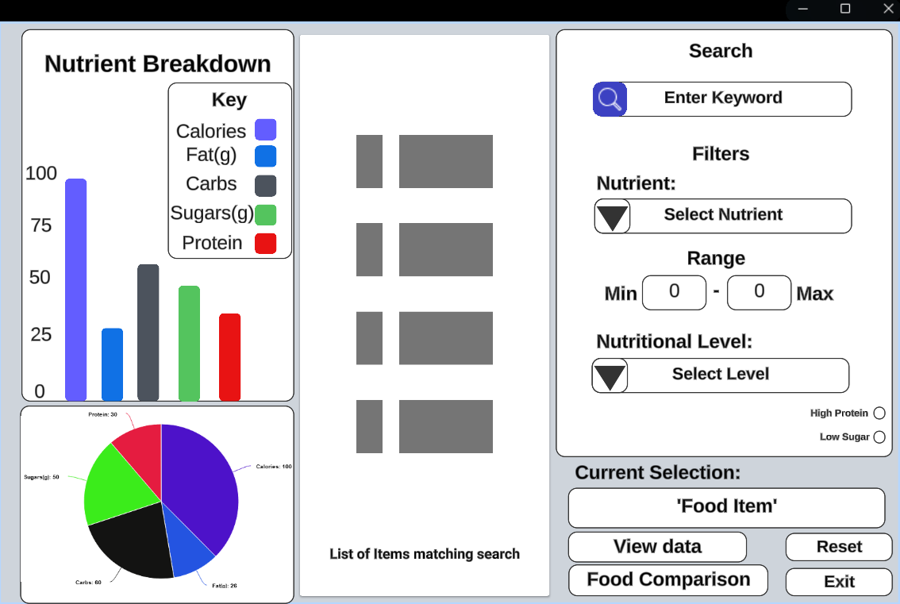
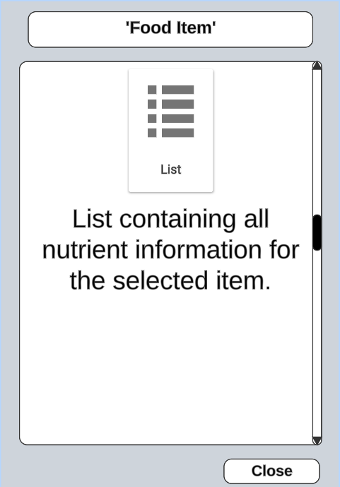
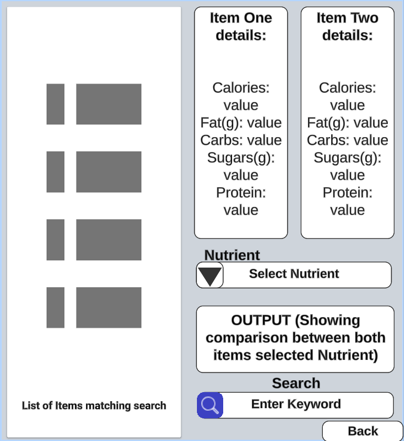

<style>
    r { color: Red; }
</style>

# Software Design Document

## Project Name: FoodDB

## Group Number: 049

## Team members

| Student Number | Name           |
|----------------|----------------|
| S5384822       | Kane Bebb      |
| S5350818       | Nick Bland     |
| S5403634       | Cameron Cassar |

## Table of Contents

<!-- TOC -->
* [Table of Contents](#table-of-contents)
  * [1. System Vision](#1-system-vision)
    * [1.1 Problem Background](#11-problem-background)
    * [1.2 System capabilities/overview](#12-system-capabilitiesoverview)
    * [1.3 Potential Benefits](#13-benefit-analysis)
  * [2. Requirements](#2-requirements)
    * [2.1 User Requirements](#21-user-requirements)
    * [2.2 Software Requirements](#22-software-requirements)
    * [2.3 Use Case Diagrams](#23-use-case-diagram)
    * [2.4 Use Cases](#24-use-cases)
  * [3. Software Design and System Components](#3-software-design-and-system-components)
    * [3.1 Software Design](#31-software-design)
    * [3.2 System Components](#32-system-components)
      * [3.2.1 Functions](#321-functions)
      * [3.2.2 Data Structures / Data Sources](#322-data-structures--data-sources)
      * [3.2.3 Detailed Design](#323-detailed-design)
  * [4. User Interface Design](#4-user-interface-design)
    * [4.1 Structural Design](#41-structural-design)
    * [4.2 Visual Design](#42-visual-design)
<!-- TOC -->

<!-- Kane -->
## 1. System Vision

### 1.1 Problem Background

**<ins>Problem Identification:</ins>**\
Obfuscation that exists in today's society in the food we consume, their ingredients, calories, and the nutrients that they provide is a serious problem for consumers looking to maintain a healthy diet and lifestyle. Notably there is no 'simple', 'detailed' way to tell if a meal is actually nutritious. The closest measurement available is health ratings on the packages of some products, often denoted by a star system. But even those can be unreliable with their lacking of detail. Through the use of this system users will be able to interact with a food database, obtaining all necessary data for living or maintaining a healthy diet. We will enable user's to view nutritional breakdowns to aid in their understanding of how the food/meals they are eating are processed and used by their body. We will also enable user's to filter between nutrition levels, aiding those who want to strictly maintain a 'High', 'Mid', or 'Low' nutrition level in their diet, while also keeping the whole process simple and easily understandable for the end user.

**<ins>Dataset:</ins>**\
The dataset being used consists of a 'Nutritional Food database'. This database has comprehensive nutritional information for a large amount of commonly consumed foods around the world. The database contains information ranging from the name of the food, caloric value and fat, to the exact vitamins and minerals that exist within each item.

**<ins>Data Input/Output:</ins>**

**Input Requirements**:\
For this software there is a base-level input requirement of a Nutritional Database. And for the users, requirements consist of queries to be made on the database, and instructions given for the program to execute.

**Output Requirements**:\
Base-level output requirements from this software is the ability to display data queried by the user. Beyond that, the requirements extend to the ability to display the data in different ways, such as through different types of graphs.

**<ins>Target Users:</ins>**\
Our target users consist of (but are not limited to) health-aware individuals, nutrition specialists, and unhealthy users looking to change their diet/lifestyle. The unifying factor between these different users is the need to learn, understand, and have ease of access to reliable data related to nutrition.

### 1.2 System capabilities/overview
  
**<ins>System Functionality:</ins>**\
This system will meet the functionality requirements set by stakeholders; requirements, such as the ones discussed in 'section 1.1: Data Input/Output'.

However, a general overview of the functionality of the system is as follows:

* The user will input queries into the system, allowing them to interact with the database.
* The system will display output depending on the input of the user and the available data.
* The system will have the capability to display queried data in using data visualisation techniques (Nutrition Breakdown).
* The system will have the capability to apply several different filters to the database (Nutrition Range, Nutrition Level)
* The system will have the capability to make comparisons between different foods within the database.

**<ins>Key Features and Functionalities:</ins>**

**Data Querying:**\
A key feature of this system is the ability to allow the user to interact with the database, querying it directly for types of food, nutrition, etc.

**Data Visualisation:**\
Data visualisation in this system will enable the user to display the data they've queried in visually engaging ways, increase legibility of the data and enabling the user to not only understand the data more themselves, but also share the data with greater ease.

**Data Filtration:**\
Data filtration will work along-side data querying to allow users to define their search more accurately. Filters will allow the user to select items with the specific requirements and specifications they need.

**Food Comparison:**\
The Food Comparison feature will enable users to compare two different items from the database against each other. Through this comparison users will be able to gain a clearer picture of which foods are 'healthier' than others.

### 1.3 Benefit Analysis

**<ins>How will this system provide value or benefit?</ins>**\
This system provides value or benefit in several different ways, these include:

* **Education:** The system enables users to educate themselves on nutritional information of many different foods.
* **Health and General Wellbeing**: Through use of the system and understanding of the finer details of what makes up the food we eat daily, the user will be more likely to improve their health by choosing healthier alternatives and therefore more likely to improving their general wellbeing.
* **Financial Benefit**: A common misconception with healthy eating is that it is expensive and costs more to maintain a healthy lifestyle. This misconception is born from a misunderstanding of nutrition and the value we get from our food. With a greater understanding of nutrition a user can enable themselves to more precisely budget their food shopping; purchasing healthy ingredients & potentially saving money over quick processed meals.
* **Teaching Assistance**: This system can be used as a teaching tool to educate other people on the benefits of nutrition and the difference between different types of food. This value can be leveraged not just by teachers in the education sector but also by professionals such as nutritionist that want to visually explain to their clients nutritional concepts.

<!-- Cam -->
## 2. Requirements

1. Food Search:
    * Need: Users need to quickly find detailed nutritional information for specific food items.
    * Functionality: The system shall provide a search function that allows users to input a food name and retrieve detailed nutritional data for that food item.
    * User Interaction: The user inputs the food name into a search bar. The system displays all relevant nutritional information, organized by category (eg calories, fats, vitamins, minerals, ect).

2. Nutrition Breakdown:
    * Need: Users need to visualize the nutrient composition of a specific food item to better understand its nutritional profile.
    * Functionality: The system shall allow users to select a food item and generate visualizations such as pie charts and bar graphs which will show the breakdown of different nutrients.
    * User Interaction: After selecting a food item, the user can view various charts that visually represent the proportions of macro-nutrients, vitamins, and minerals.

3. Nutrition Range Filter:
    * Need: Users want to identify foods that meet specific nutritional criteria such as foods low in sugar or high in protein.
    * Functionality: The system shall allow users to select a nutritional category (eg protein or fat) and specify a range (minimum and maximum values). The tool then displays foods that fall within the selected range.
    * User Interaction: The user selects a nutrient and inputs the desired range. The system filters the database and lists foods that meet the criteria.

4. Nutrition Level Filter:
    * Need: Users want to categorize foods based on their nutritional content to make informed dietary choices.
    * Functionality: The system shall allow users to filter foods based on predefined nutritional levels (low, mid, high) for specific nutrients, including fat, protein, carbohydrates, sugar, and nutritional density.
    * User Interaction: The user selects a nutrient and a level (low, mid, high). The system filters and lists the foods that correspond to the selected level.

5. Additional Feature: food comparison
    * Need: Users may want to compare the nutritional content of multiple food items to make better dietary decisions.
    * Functionality: The system should allow users to select multiple foods and generate side by side comparisons of their nutritional content.
    * User Interaction: The user selects multiple food items. The system displays a comparative table or chart, allowing the user to easily compare the nutritional values of the selected items.

### 2.1 User Requirements

For this project users are expected to interact with the program through a digital interface that allows for instant navigation and utilization of the tool's features. The functionalities provided by the system will be designed to cater to the needs of individuals interested in analyzing and visualizing nutritional data for various food items.

The software will be designed for use by dietitians, nutritionists, health-conscious individuals, and meal planners who need to analyze the nutritional content of various foods. This diverse user base includes professionals in healthcare, fitness, and education, as well as individuals dedicated to maintaining a balanced diet and planning nutritionally sound meals.

The system shall provide intuitive functionalities that cater to the needs of dietitians, nutritionists, health-conscious individuals, and meal planners. Users will be able to search for food items quickly, filter them by specific nutritional ranges or levels, and compare multiple foods side by side. Visual tools like pie charts or bar graphs will be available to break down and present nutritional information clearly. The system shall offer easy navigation with accurate data and customizable options to support informed dietary planning and decision-making.

### 2.2 Software Requirements

R1. Food Search
R1.1 The program shall allow users to search for food items by name.
R1.2 The program shall display all nutritional information related to the searched food item including calories, fats, proteins, vitamins, and minerals.
R1.3 The program shall handle partial name matches and provide suggestions for similar food items if the exact match is not found.

R2. Nutrition Breakdown
R2.1 The program shall allow users to select a food item and view its nutritional composition.
R2.2 The program shall display the nutritional breakdown in the form of pie charts and bar graphs.
R2.3 The program shall allow users to hover over or click on the visualizations to see detailed values for each nutrient.

R3. Nutrition Range Filter
R3.1 The program shall allow users to filter food items based on a selected nutrient.
R3.2 The program shall accept minimum and maximum values for the selected nutrient.
R3.3 The program shall display a list of foods that fall within the specified nutrient range.

R4. Nutrition Level Filter
R4.1 The program shall categorize foods into low, mid, or high levels based on their nutritional content.
R4.2 The program shall allow users to filter foods by these nutritional content levels (low, mid, high) for selected nutrients such as fat, protein, carbohydrates, and sugar.
R4.3 The program shall define the levels as: Low (less than 33% of the highest value), Mid (between 33% and 66% of the highest value), and High (greater than 66% of the highest value).

R5. Nutritional Comparison Tool
R5.1 The program shall allow users to select multiple food items for comparison.
R5.2 The program shall display a comparison table showing the nutritional content of the selected food items side by side.
R5.3 The program shall provide visual graphs like bar charts to highlight differences in key nutrients among the selected food items.

R6. Data Management
R6.1 The program shall load the Nutritional Food Database from a file when started up.
R6.2 The program shall handle large datasets efficiently so there are quick response times for search and filtering.
R6.3 The program shall allow for future improvements of the database letting users to add new food items and their nutritional information.

These functional requirements are so software meets the needs of its users by providing accurate and easy to use tools for analyzing and visualizing nutritional data.

### 2.3 Use Case Diagram

Provide a system-level Use Case Diagram illustrating all required features.

Example:  

<r>Extended Diagram to show 'Data Visualisation' isntead of 'Bar Charts/Graphs' as per feedback given in Milestone 1</r>

### 2.4 Use Cases

Include at least 5 use cases, each corresponding to a specific function.

| Use Case ID    | UC1                                                                                                            |
|----------------|----------------------------------------------------------------------------------------------------------------|
| Use Case Name  | Search for food                                                                                                |
| Actors         | Dietitian, Nutritionist, Health-Conscious Individual, Meal Planner                                             |
| Description    | The user searches for a specific food item by entering its name and retrieves detailed nutritional information |
| Flow of Events | 1. The user enters the name of a food item in the search bar.<br/>2. The system searches the database for the entered food item.<br/>3. The system displays the nutritional information for the food item.                                                                                                           |
| Alternate Flow | If the food item is not found, the system suggests similar items.                                                                                                           |

| Use Case ID    | UC2  |
|----------------|------|
| Use Case Name  | View Nutrition Breakdown |
| Actors         | Dietitian, Nutritionist, Health-Conscious Individual, Meal Planner |
| Description    | The user selects a food item to view its nutritional composition in pie charts and bar graphs. |
| Flow of Events | 1.The user selects a food item from the list.<br/>2.  The system generates and displays pie charts and bar graphs showing the breakdown of nutrients for the selected food. |
| Alternate Flow | If no food item is selected, the system prompts the user to select one |

| Use Case ID    | UC3                                                                                                                                |
|----------------|------------------------------------------------------------------------------------------------------------------------------------|
| Use Case Name  | Filter Foods by Nutrient Range                                                                                                     |
| Actors         | Dietitian, Nutritionist, Meal Planner                                                                                              |
| Description    | The user filters food items based on a selected nutrient range to find foods that meet specific dietary criteria.                  |
| Flow of Events | 1. The user selects a nutrient from a dropdown menu.<br/>2. The user inputs the minimum and maximum values for the nutrient range.<br/>3. The system filters and displays foods that fall within the specified range. |
| Alternate Flow | If no foods match the criteria, the system notifies the user and suggests broadening the range.|

| Use Case ID    | UC4                                                                                                                                                                                                                                     |
|----------------|-----------------------------------------------------------------------------------------------------------------------------------------------------------------------------------------------------------------------------------------|
| Use Case Name  | Filter Foods by Nutritional Level                                                                                                                                                                                                       |
| Actors         | Dietitian, Nutritionist, Meal Planner                                                                                                                                                                                                   |
| Description    | The user filters food items by categorizing them into low, mid, or high levels based on selected nutritional content.                                                                                                                   |
| Flow of Events | 1.The user selects a nutrient for filtering.<br/>2. The system categorizes foods into low, mid, or high levels based on the selected nutritional content. <br/> 3. The system displays the foods according to their categorized levels. |
| Alternate Flow | . If no foods match the selected level, the system suggests alternative categories or criteria.                                                                                                                                         |

| Use Case ID    | UC5                                                                                                                                                                         |
|----------------|-----------------------------------------------------------------------------------------------------------------------------------------------------------------------------|
| Use Case Name  | Compare Nutritional Content                                                                                                                                                 |
| Actors         | Dietitian, Nutritionist, Meal Planner                                                                                                                                       |
| Description    | The user selects multiple food items to compare their nutritional content side by side.                                                                                     |
| Flow of Events | 1. The user selects multiple food items from a list. <br/>2. The system generates a comparison table and visual graphs that display the differences in nutritional content. |
| Alternate Flow | If less than two items are selected, the system prompts the user to select additional items for comparison.                                                                 |

<!-- Nick -->
## 3. Software Design and System Components

### 3.1 Software Design

The following is a flowchart showcasing the general flow of how a user is expected to interact with the software.


### 3.2 System Components

#### 3.2.1 Functions

| **Name**            | **Description**                                                                                                                            | **Parameters**                                                                | **Return Value**                                                              | **Side Effects**                                                  |
|---------------------|--------------------------------------------------------------------------------------------------------------------------------------------|-------------------------------------------------------------------------------|-------------------------------------------------------------------------------|-------------------------------------------------------------------|
| initDatabase()      | Initialise the database from disk in to local memory to be used in the application (Much quicker than reading off disk for each operation) | filePath(string)                                                              | The new global database variable                                              | Creates a global database from the csv file                       |
| searchDatabase()    | Search the food database for foods based on the parameters provided by the user                                                            | foodName (string), filters (optional, Python Dictionary of nutrient, min/max) | A list of foods (python dictionary), or calls displayError if none were found | None.                                                             |
| retrieveNutrients() | Retrieve the nutrient data for a specific food                                                                                             | food(Python Dictionary for selected food)                                     | A list of nutrients for the food (dictionary)                                 | None.                                                             |
| displayNutrients()  | Create charts on the nutritional data for a food                                                                                           | foodData(dictionary of food data)                                             | None. Draws directly to screen                                                | None.                                                             |
| displayFood()  | Display data for an individual food item, in a separate pop-up window                                                                                           | foodData(dictionary of food data)                                             | None. Draws directly to screen                                                | None.                                                             |
| addComparison()     | Add a food item to the comparison list                                                                                                     | food(Python Dictionary for selected food)                                     | None.                                                                         | Updates the global comparisonList variable                        |
| removeComparison()  | Remove a food item from the comparison list                                                                                                | food(Python Dictionary for selected food)                                     | None.                                                                         | Updates the global comparisonList variable                        |
| displayComparison() | Create charts and comparison data based off the comparison list. This should be presented in a separate window.                            | None.                                                                         | None. Draws directly to screen                                                | None.                                                             |
| clearComparison()   | Stop displaying the comparison window, and clear all data from the comparison list.                                                        | None.                                                                         | None.                                                                         | Updates the global comparisonList variable by removing all values |
| displayError()      | Display a simple pop-up error message that can be closed.                                                                                  | message(string)                                                               | None. Draws directly to screen                                                | None.                                                             |

#### 3.2.2 Data Structures / Data Sources

| **Type**         | **Usage**                                                                                                                                                                                                      | **Functions**                                                                                                                                                                                                                                                                                                                                                                                                                                                                                                                                                                                |
|------------------|----------------------------------------------------------------------------------------------------------------------------------------------------------------------------------------------------------------|----------------------------------------------------------------------------------------------------------------------------------------------------------------------------------------------------------------------------------------------------------------------------------------------------------------------------------------------------------------------------------------------------------------------------------------------------------------------------------------------------------------------------------------------------------------------------------------------|
| Dictionary       | Used in place of a JavaScript Object, the dictionary is used to house complex data types that need to be grouped together. E.g. a food has a name + a lot of other parameters that need to be stored together. | While the data in the database global function is technically a Pandas.DataFrame. It behaves extremely similarly to the python dictionary data structure. Data will often be shaped in to a dictionary for display purposes to avoid frequent calls to the global variable when needed. As such, it shall be used as a parameter for the searchDatabase(), retrieveNutrients(), displayNutrients(), displayFood(), addComparison(), removeComparison() functions. These functions parse the data returned from the retrieveNutrients() function, who creates dictionaries from the global database variable |
| List             | Simple list structure used to house a group of data together. In this application, data that returns or uses multiple dictionaries (objects) will utilise a list of them                                       | Returned from the searchDatabase(). Also utilised in the comparisonList variable which houses a list of food objects to compare with each other. This means the addComparison(), removeComparison(), clearComparison(), and displayComparison() functions all utilise lists                                                                                                                                                                                                                                                                                                                  |
| Pandas.DataFrame | Since this assignment uses pandas, the Pandas read_csv() function returns data in the form of a DataFrame data structure. This is a 2-dimensional data structure with labeled axes                             | The initDatabase() function initialises the global database variable using the Pandas.read_csv() function. The other functions will read from this data structure, hence its inclusion here.                                                                                                                                                                                                                                                                                                                                                                                                 |
| String           | Primitive data structure used to display or format simple pieces of text on the screen.                                                                                                                        | The searchDatabase() function utilises a string as a search term. The displayError() function uses a string as an argument for messages to display.                                                                                                                                                                                                                                                                                                                                                                                                                                          |

#### 3.2.3 Detailed Design

##### 3.2.3.1 initDatabase()

```python
DATABASE = "" # Empty database global variable initialised beforehand

def initDatabase(filePath):
  LOAD data from filePath INTO DATABASE
  return DATABASE
```

##### 3.2.3.2 searchDatabase()

<r>Update to include the checkFilters() function</r>

```python
def searchDatabase(foodName, filters OPTIONAL):
  foodList = [] # Empty list to return
  IF filters EXISTS
    FOR EACH FILTER in filters
      IF filter IS NOT 0
        DATABASE = CALL checkFilters(filters) # Update the database with the filters
      ENDIF
    ENDFOR
    FOR EACH ROW IN DATABASE
      IF foodName IN ROW && FILTERS MATCH ROW
        foodlist.append(CALL retrieveNutrients(ROW))
      ENDIF
    ENDFOR
  ELSE
    FOR EACH ROW IN DATABASE
      IF foodname IN ROW
        foodlist.append(CALL retrieveNutrients(ROW))
      ENDIF
    ENDFOR
  ENDIF

  IF foodList IS EMPTY
    CALL displayError("No foods found with given search parameters")
    RETURN # Return nothing.
  ELSE
    RETURN foodList
  ENDIF
```

##### 3.2.3.3 checkFilters()

<r>Update to include the filterLow(), filterMid(), and filterHigh() functions</r>

```python
def checkFilters(database, filters, nutrient):\
  DATABASE = database # Set the database to the passed through database
  FOR EACH FILTER in filters
    IF FILTER IS LOW
      DATABASE = CALL filterLow(database, FILTER, nutrient)
    ELSE IF FILTER IS MID
      DATABASE = CALL filterMid(database, FILTER, nutrient)
    ELSE IF FILTER IS HIGH
      DATABASE = CALL filterHigh(database, FILTER, nutrient)
    ENDIF
  ENDFOR
  RETURN DATABASE

```

##### 3.2.3.4 filterLow()

<r> NEW FUNCTION </r>

```python
def filterLow(database, nutrient):
  FILTERED_DATABASE = [] # Empty list to return
  MAX_VALUE = MAX(database[nutrient]) # Get the maximum value of the nutrient
  FOR EACH ROW IN DATABASE
    IF ROW[nutrient] < (MAX_VALUE / 3) # If the nutrient is less than 33% of the maximum value
      FILTERED_DATABASE.append(ROW) # Add the row to the filtered database
    ENDIF
  ENDFOR
  RETURN FILTERED_DATABASE
  
```

##### 3.2.3.5 filterMid()

<r> NEW FUNCTION </r>

```python
def filterMid(database, nutrient):
  FILTERED_DATABASE = [] # Empty list to return
  MAX_VALUE = MAX(database[nutrient]) # Get the maximum value of the nutrient
  FOR EACH ROW IN DATABASE
    IF ROW[nutrient] < (MAX_VALUE / 6) AND ROW[nutrient] > (MAX_VALUE / 3) # If the nutrient is between 33% and 66% of the maximum value
      FILTERED_DATABASE.append(ROW) # Add the row to the filtered database
    ENDIF
  ENDFOR
  RETURN FILTERED_DATABASE

  
```

##### 3.2.3.6 filterHigh()

<r> NEW FUNCTION </r>

```python
def filterHigh(database, nutrient):
  FILTERED_DATABASE = [] # Empty list to return
  MAX_VALUE = MAX(database[nutrient]) # Get the maximum value of the nutrient
  FOR EACH ROW IN DATABASE
    IF ROW[nutrient] > (MAX_VALUE / 6) # If the nutrient is greater than 66% of the maximum value
      FILTERED_DATABASE.append(ROW) # Add the row to the filtered database
    ENDIF
  ENDFOR
  RETURN FILTERED_DATABASE
  
```

##### 3.2.3.7 addComparison()

<r> UPDATE to both add and remove a food item from the comparison list </r>

```python
comparisonList = [] # List of foods to compare

def addComparison(food):
  IF food IN comparisonList
    comparisonList.remove(food)
  ELSE
    comparisonList.append(food)
  ENDIF
  RETURN
  
```

##### 3.2.3.8 displayResults()

<r> NEW FUNCTION </r>

```python
def displayResults(filteredData):
  CREATE NEW window

  # Create a table
  TABLE resultsTable
  HEADER = ['Food', 'Calories', 'Fat', 'Carbs', 'Protein']
  FOR EACH foodObject IN filteredData
    ROW = [foodObject['name'], foodObject['calories'], foodObject['fat'], foodObject['carbs'], foodObject['protein']]
    resultsTable ADD ROW
  ENDFOR

  DRAW resultsTable TO window # Draw the table to the window
  RETURN
```

##### 3.2.3.9 reset()

<r>NEW FUNCTION</r>

```python

def reset():
  comparisonList = [] # Reset the comparison list
  searchFilters = {} # Reset the search filters
  searchNutrient = "" # Reset the search nutrient
  searchName = "" # Reset the search name
  RETURN
```

##### 3.2.3.10 displayError()

```python
def displayError(message):
  # Simple pop-up error message
  DISPLAY message AS popup
  RETURN
```

##### 3.2.3.11 updateFood()

<r>NEW FUNCTION</r>

```python
def updateFood(food, comparisonList, UI):
  # Create a new window
  CREATE NEW window

  IF UI.selected = single
    # Create a pie chart
    CHART pieChart
    DATA = food
    DRAW pieChart TO window # Draw the pie chart to the window

    # Create a bar chart
    CHART barChart
    DATA = food
    DRAW barChart TO window # Draw the bar chart to the window

    # Display the food data
    TABLE foodTable
    INSERT food.data INTO foodTable
    DRAW foodTable TO window # Draw the table to the window
  ELSE
    # Create a comparison table
    TABLE foodA, foodB
    INSERT comparisonList[0].data INTO foodA
    INSERT comparisonList[1].data INTO foodB
    DRAW comparisonTable TO window # Draw the table to the window

    # Create a comparison bar chart
    CHART comparisonChartA, comparisonChartB
    comparisonChartA.DATA = comparisonList[0]
    comparisonChartB.DATA = comparisonList[1]
    DRAW comparisonChartA, comparisonChartB TO window # Draw the bar chart to the window

    # Create a comparison pie chart
    CHART comparisonPieA, comparisonPieB
    comparisonPieA.DATA = comparisonList[0]
    comparisonPieB.DATA = comparisonList[1]
    DRAW comparisonPieA, comparisonPieB TO window # Draw the pie chart to the window

  ENDIF
  RETURN
```

## 4. User Interface Design

<!-- Nick & Kane -->
### 4.1 Structural Design

**Structure**:\
The structure of the software as shown in the 'Hierarchy Chart', provides a visual explanation of how the software will be structured through different windows, and the way that information is processed and displayed. The structure will begin from the base or the 'Main Window', from which all other features will be accessible. 

**Information Grouping**:\
Information is grouped according to what features it interacts with or inherits. For example the search feature is grouped with filters that are used to define a search more accurately. 

**Navigation**:\
Users will navigate through the software by moving through two different windows and a popup window. The window labeled 'Main Window' (see [Visual Design](#42-visual-design)), will be used as a central point to move to other areas of the software. No matter what, the user will return to the 'Main Window'. 

**Design Choices**:\
As mentioned below in [Visual Design](#42-visual-design), designs choices were made for readability and ease of use. There was also a conscientious effort to make the designs easily iterable, as the app is likely to change throughout the development life cycle. 


<!-- Kane -->
### 4.2 Visual Design
**<ins>Discussion:</ins>**

**Iterative Design**:\
Iterative design was considered heavily when creating the mockup designs for this project. Specifically in regard to designing each feature inside of its own 'box' or 'tile'. The reason for this is to allow iterative design. The 'boxes' or 'tiles' will allow us to shift and move features around when the testing phase of the project begins. 

**Possible limitations**:\
Possible limitations that could exist for this project would be regarding the required software/tool-kits. For example: The requirement to use wxPython may provide limitations due to it's dated technology. This could limit our abilities in regards to features within the UI. 

**The Users Perspective**:\
It's important to consider the user's perspective when designing a UI, placing yourself in the shoes of the customer/consumer is the key to creating a useful product. Thankfully, this applications design and use case are quite simple and serve a likewise, simple purpose. As this program/system is likely to be used by professionals and hobbyists alike, it was evermore important to keep the design simple. 

The reason for us focusing on simplicity is that the most likely crossroads where the needs of both the hobbyist and professional overlap is in ease of use, and speed for getting results. And as such, that is one of our main focuses, and design philosophies that we adhered too in the design process. 

**<ins>Explanation:</ins>**

**Main Window**:\
The main window for this application follows the principles of readability and ease of use. Each section is clearly contained within it's own box and provides a natural 'flow' of events that the user will go through.

**(Search &rarr; Look at list &rarr; Select item and view data on left)**

It's also important to note that while the UI in the mockups is designed to work from right to left (see above), the left-hand side, and the right-hand side could be easily swapped if decided that left to right was preferred.

**Food Info Window**:\
The general idea behind the info window was to have a 'popup' window appear when the user clicks the 'view data' button on the main window. This 'popup' would provide a list containing all the data related to the currently selected item. Data, such as: Name, calories, fat, carbs, and all other nutritional information (vitamins etc.).

**Food Comparison Window**:\
For this feature, the window that appears was designed to function similarly to the main window. Allowing the user to search for an item, have the list provide items closely related, and then have the user select two items; Item One, and Item Two, to be compared. A brief display on the right-hand side of the window will showcase basic data about each item, providing an easy way to compare. And for more In-depth comparisons: The Nutrient filter can be leveraged, once a nutrient is selected data will display in the 'OUTPUT' box, where a comparison will be shown between Item One and Item Two based on the chosen nutrient. 

**<ins>Justification:</ins>**

**Main Window**:\
The layout of the main window was designed to be easy to read, and easy to understand. Simple, clearly defined buttons were used to help the user navigate through the program, accompanied by a modern 'box/tile' type layout, making it simple to understand what section each bit of data belongs to. For example: Logically, seeing that there is a box labeled 'Search' would logically lead a user to assume that all things related to search (filters, settings etc.), would be contained within. 

The design choice to have each 'section' contained within it's own box was so because of flexibility. The boxes allow us to easily shift the sections around within the window during the development cycle, and provides an easy way for us to iterate on designs throughout the project. 

**Food Info Window**:\
Akin to the 'Main Window', this window was also designed with the philosophy of 'ease of use' and 'readability'. Because this is simply a popup window, there wasn't too many design choices necessary at this stage. The goal was simply to provide the information the user request, which in this case, is a comprehensive list of all the information on a selected food item. So, for that reason, the design of the popup window is simple: A window containing a title, list, and a close button. Due to the simplicity of this window, artistic design decisions such as colour and style can be altered throughout the project. 

**Food Comparison Window**:\
In this window the user will be able to compare two different items to one and other. As with the other windows, each item, be that button, dropdown or list, is contained within their own box. Enabling us to iterate on the design when it comes to building the app. 

In this window there's a list which will function similarly to the lists on both of the other windows. Alongside this list is several inputs, namely, a search function that works practically the same as the one on the main window, and a nutrient dropdown selector to define the comparison type. Once the comparison type is selected and two Item's have also been chosen: The user will see an output at the bottom of the screen in it's own 'Output' box. 

In the top right we wanted to provide the user with a quick way to compare details of two different items without having to select specific nutrients each time. For that reason, the two boxes at the top right of the window exist; each box represents one of the selected items and shows key nutritional information, such as: Fat, carbs, sugars, protein, and feasibly more as development progresses, this is an aspect of the design that could be easily iterated upon. 

---
## <center><ins>Mockups</ins></center>

__'Main Window', this is the first window the user will interact with, serving as a central point from where they will access all other features.__


---
__'Food Info Popup', this is a popup window that will be displayed to users when they select 'View Data' after having selected a food item.__


---
__'Food Comparison Window', this is a window that will be displayed when the user clicks 'Food Comparison' on the 'Main Window'.__
