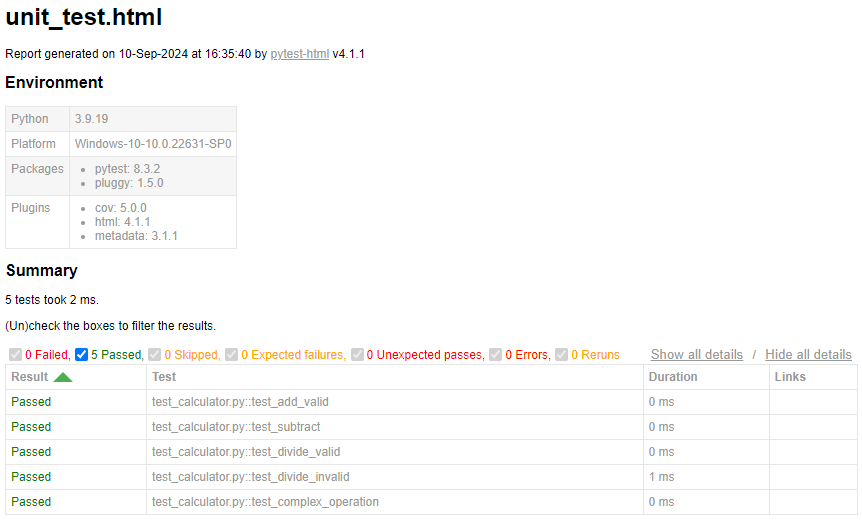

# Unit Testing Report

Please provide your GitHub repository link.
### GitHub Repository URL: https://github.com/NickBland/2810ICT-milestone-2.git

---

The testing report should focus solely on <span style="color:red"> testing all the self-defined functions related to 
the five required features.</span> There is no need to test the GUI components. 
Therefore, it is essential to decouple your code and separate the logic from the GUI-related code.


## 1. **Test Summary**
list all tested functions related to the five required features and the corresponding test functions designed to test 
those functions, for example:

## 1. **Test Summary**

| **Tested Functions**           | **Test Functions**                               |
|-------------------------------|--------------------------------------------------|
| `initDatabase(filePath)`       | `test_initDatabase_with_valid_csv()`             |
|                               | `test_initDatabase_with_empty_csv()`             |
|                               | `test_initDatabase_with_invalid_file_path()`     |
|                               | `test_initDatabase_with_empty_file_path()`       |
|                               | `test_initDatabase_with_nonexistent_file()`      |
| `searchDatabase(filters, db)`  | `test_searchDatabase_with_keyword()`             |
|                               | `test_searchDatabase_with_nutrient_range()`      |
|                               | `test_searchDatabase_with_nutrient_level()`      |
|                               | `test_searchDatabase_with_invalid_minmax()`      |
|                               | `test_searchDatabase_with_all_filters()`         |
|                               | `test_searchDatabase_with_low_protein()`         |
|                               | `test_searchDatabase_with_mid_protein()`         |
|                               | `test_searchDatabase_with_high_protein()`        |
|                               | `test_searchDatabase_with_no_filters()`          |
| `displayResults(results, grid)`| `test_displayResults()`                          |

---

## 2. **Test Case Details**

### Test Case 1:
- **Test Function/Module**
  - `test_initDatabase_with_valid_csv()`
- **Tested Function/Module**
  - `initDatabase(filePath)`
- **Description**
  - This function loads a CSV file into the database. The purpose of the test is to check whether the database is correctly loaded when given a valid CSV file.
- **1) Valid Input and Expected Output** 

| **Valid Input**               | **Expected Output**               |
|-------------------------------|-----------------------------------|
| `filePath = "test_valid.csv`  | `returns result as Database, error as None` |


- **1) Code for the Test Function**
```python
def test_initDatabase_with_valid_csv(setup_files):
    valid_csv_path, _, _ = setup_files
    result, error = initDatabase(valid_csv_path)
    assert result is not None
    assert error is None
```
- **2) Invalid Input and Expected Output**

| **Invalid Input**             | **Expected Output** |
|-------------------------------|---------------------|
| `divide(10, 0)`               | `Handle Exception`  |
| `add more cases in necessary` | `...`               |

- **2) Code for the Test Function**
```python
def test_divide_invalid():
    with pytest.raises(ValueError) as exc_info:
        divide(10, 0)
    assert exc_info.type is ValueError
```
### Test Case 2:
- **Test Function/Module**
  - `test_divide_valid()`
  - `test_divide_invalid()`
- **Tested Function/Module**
  - `divide(a, b)`
- **Description**
  - A brief description of the tested function's usage, including its purpose, input, and output.
- **1) Valid Input and Expected Output**  

| **Valid Input**               | **Expected Output** |
|-------------------------------|---------------------|
| `divide(10, 2)`               | `5`                 |
| `divide(10, -2)`              | `-5`                |
| `add more cases in necessary` | `...`               |

- **1) Code for the Test Function**
```python
def test_divide_valid():
    assert divide(10, 2) == 5
    assert divide(10, -2) == -5
```
- **2) Invalid Input and Expected Output**

| **Invalid Input**             | **Expected Output** |
|-------------------------------|---------------------|
| `divide(10, 0)`               | `Handle Exception`  |
| `add more cases in necessary` | `...`               |

- **2) Code for the Test Function**
```python
def test_divide_invalid():
    with pytest.raises(ValueError) as exc_info:
        divide(10, 0)
    assert exc_info.type is ValueError
```

### Test Case 3:
- **Test Function/Module**
  - `test_divide_valid()`
  - `test_divide_invalid()`
- **Tested Function/Module**
  - `divide(a, b)`
- **Description**
  - A brief description of the tested function's usage, including its purpose, input, and output.
- **1) Valid Input and Expected Output**  

| **Valid Input**               | **Expected Output** |
|-------------------------------|---------------------|
| `divide(10, 2)`               | `5`                 |
| `divide(10, -2)`              | `-5`                |
| `add more cases in necessary` | `...`               |

- **1) Code for the Test Function**
```python
def test_divide_valid():
    assert divide(10, 2) == 5
    assert divide(10, -2) == -5
```
- **2) Invalid Input and Expected Output**

| **Invalid Input**             | **Expected Output** |
|-------------------------------|---------------------|
| `divide(10, 0)`               | `Handle Exception`  |
| `add more cases in necessary` | `...`               |

- **2) Code for the Test Function**
```python
def test_divide_invalid():
    with pytest.raises(ValueError) as exc_info:
        divide(10, 0)
    assert exc_info.type is ValueError
```

### Test Case 4:
- **Test Function/Module**
  - `test_divide_valid()`
  - `test_divide_invalid()`
- **Tested Function/Module**
  - `divide(a, b)`
- **Description**
  - A brief description of the tested function's usage, including its purpose, input, and output.
- **1) Valid Input and Expected Output**  

| **Valid Input**               | **Expected Output** |
|-------------------------------|---------------------|
| `divide(10, 2)`               | `5`                 |
| `divide(10, -2)`              | `-5`                |
| `add more cases in necessary` | `...`               |

- **1) Code for the Test Function**
```python
def test_divide_valid():
    assert divide(10, 2) == 5
    assert divide(10, -2) == -5
```
- **2) Invalid Input and Expected Output**

| **Invalid Input**             | **Expected Output** |
|-------------------------------|---------------------|
| `divide(10, 0)`               | `Handle Exception`  |
| `add more cases in necessary` | `...`               |

- **2) Code for the Test Function**
```python
def test_divide_invalid():
    with pytest.raises(ValueError) as exc_info:
        divide(10, 0)
    assert exc_info.type is ValueError
```


### Test Case 5:
- **Test Function/Module**
  - `test_divide_valid()`
  - `test_divide_invalid()`
- **Tested Function/Module**
  - `divide(a, b)`
- **Description**
  - A brief description of the tested function's usage, including its purpose, input, and output.
- **1) Valid Input and Expected Output**  

| **Valid Input**               | **Expected Output** |
|-------------------------------|---------------------|
| `divide(10, 2)`               | `5`                 |
| `divide(10, -2)`              | `-5`                |
| `add more cases in necessary` | `...`               |

- **1) Code for the Test Function**
```python
def test_divide_valid():
    assert divide(10, 2) == 5
    assert divide(10, -2) == -5
```
- **2) Invalid Input and Expected Output**

| **Invalid Input**             | **Expected Output** |
|-------------------------------|---------------------|
| `divide(10, 0)`               | `Handle Exception`  |
| `add more cases in necessary` | `...`               |

- **2) Code for the Test Function**
```python
def test_divide_invalid():
    with pytest.raises(ValueError) as exc_info:
        divide(10, 0)
    assert exc_info.type is ValueError
```

### Test Case 6:

add more test cases if necessary.

## 3. **Testing Report Summary**
Include a screenshot of unit_test.html showing the results of all the above tests. 

You can use the following command to run the unit tests and generate the unit_test.html report.

```commandline
pytest test_all_functions.py --html=unit_test.html --self-contained-html
```
Note: test_all_functions.py should contain all the test functions designed to test the self-defined functions related 
to the five required features.


